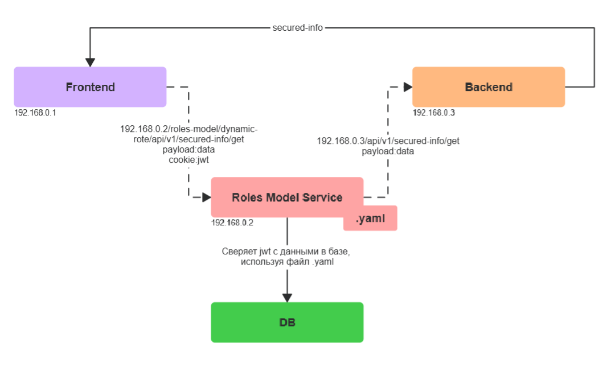
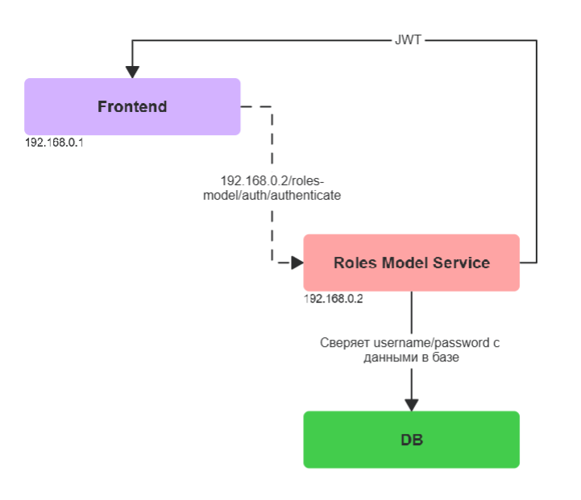
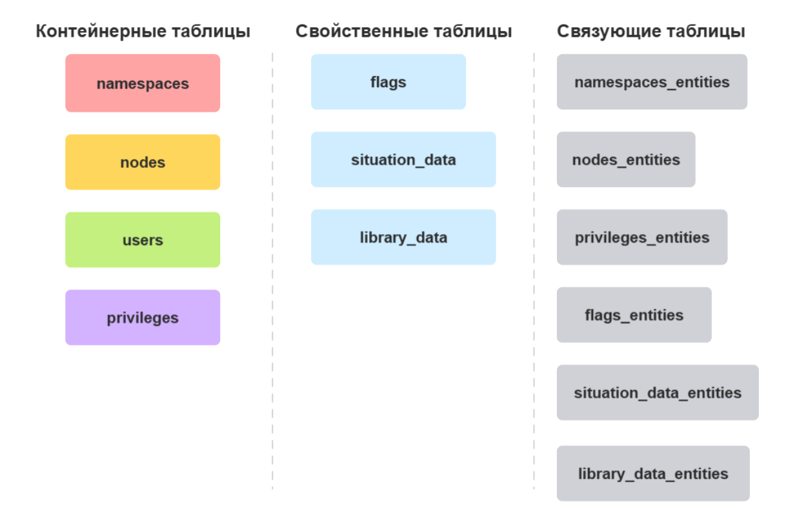
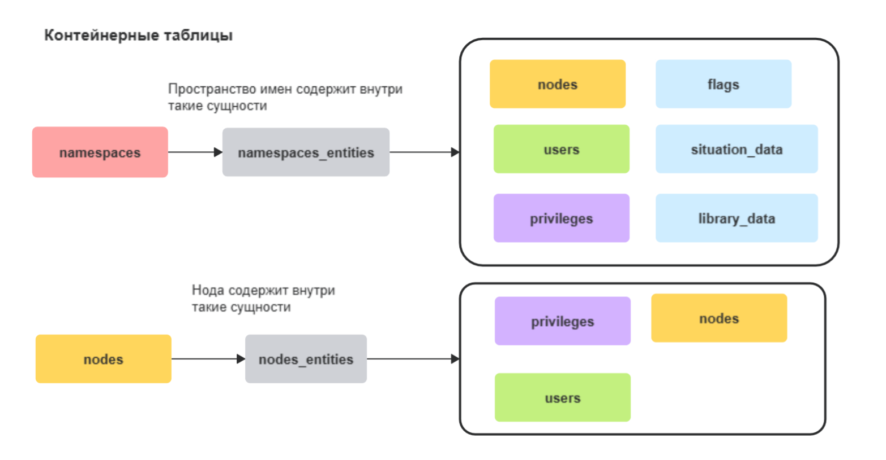
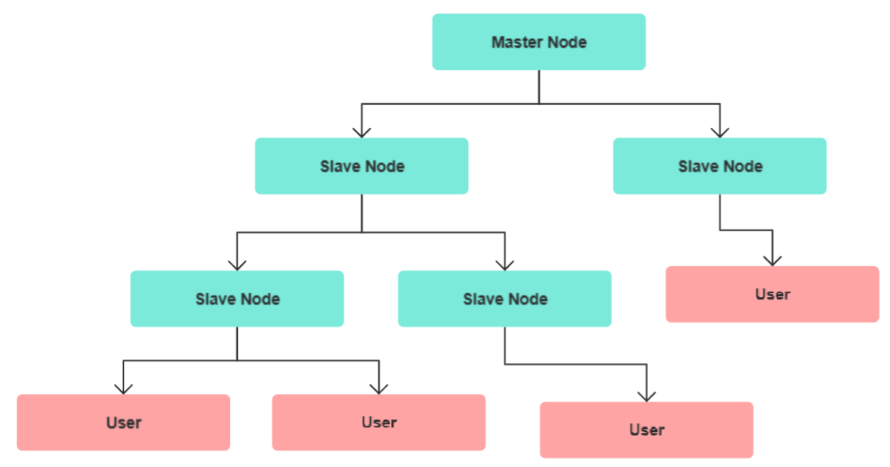
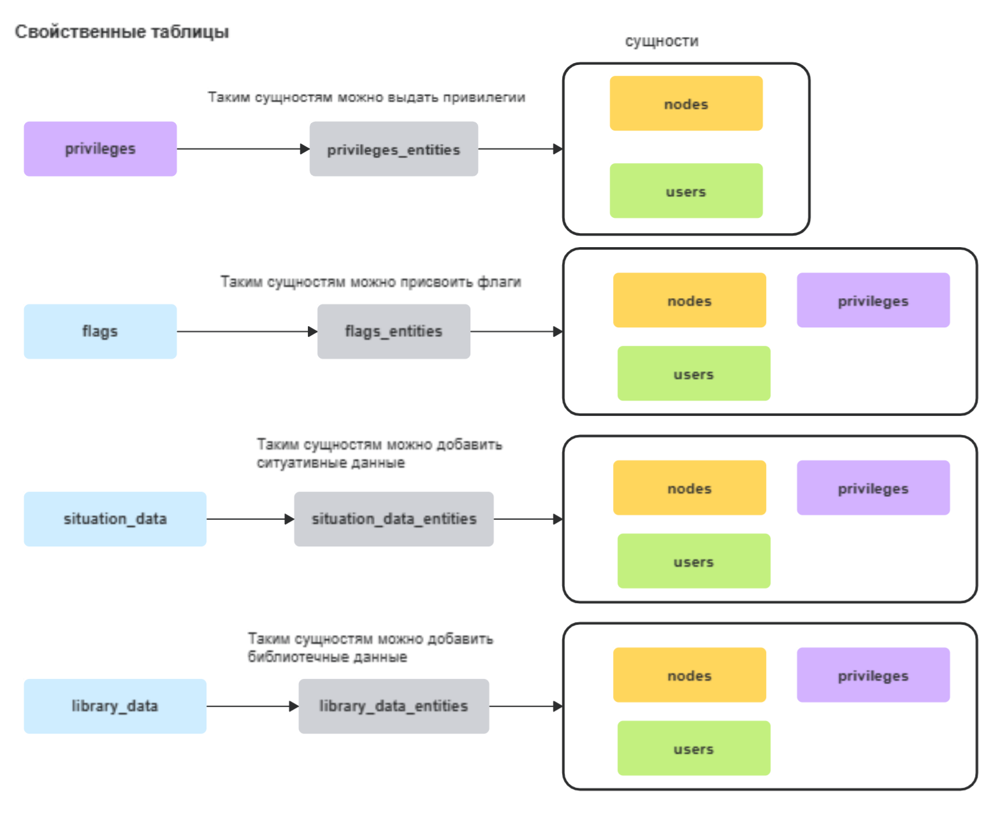
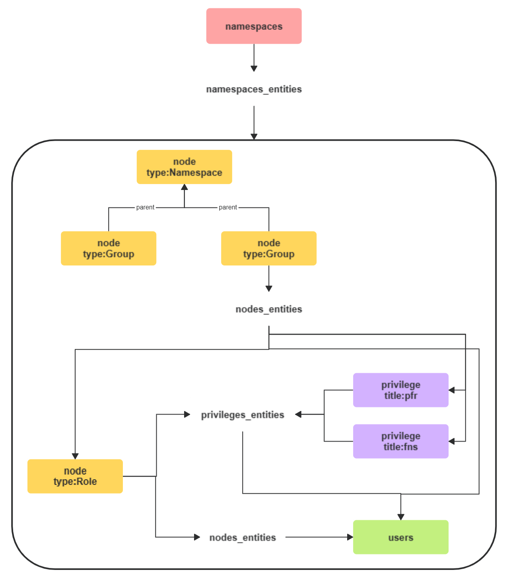

# 🔐 ROLES MODEL SERVICE

> Микросервис предоставляет единую точку входа для аутентификации и авторизации пользователей.  
> Работает как прокси между сервисами, обеспечивая безопасность на основе ролевой модели доступа.

---

<br>

## 📋 Содержание

- [🎯 Описание](#-описание) - Общее описание приложения
- [🔌 API](#-api) - Описание API приложения с примерами
- [⚙️ Конфигурационный файл .yaml](#-конфигурационный-файл-yaml) - Правила написания и размещения
- [🚀 Использование](#-использование) - Примеры взаимодействия с микросервисом
- [▶️ Запуск](#-запуск) - Установка и запуск приложения
- [🏗️ Архитектура](#-архитектура)
    - [🗄️ База Данных](#-база-данных) - Структура и схема данных
    - [⚡ Устройство микросервиса](#-устройство-микросервиса) - Бизнес-логика приложения
    - [🛠️ Технологии / Библиотеки](#-технологии--библиотеки) - Используемые зависимости
- [🧪 Тестирование](#-тестирование) - Стратегия и подходы к тестированию

---

<br>

## 🎯 Описание

### 🏛️ Общая схема взаимодействия с сервисом

<div style="text-align: left; width: 700px;">
  
  <p style="text-align: center;"><em>🏛️ Диаграмма взаимодействия Frontend - Roles Model Service - Backend</em></p>
</div>

**Frontend** отправляет запросы на **Roles Model Service** через эндпоинт `/roles-model/dynamic-rote/{*path}`.  
**Roles Model Service** валидирует `JWT` токен согласно конфигурационному файлу `.yaml` и данным в базе.  
При успешной проверке **Roles Model Service** проксирует запрос на **Backend** по адресу, указанному в конфигурационном
`.yaml` файле.

Для использования сервиса необходимо создать конфигурационный файл в формате **`.yaml`**  
и маршрутизировать запросы через этот **микросервис**. Он выступает посредником между любыми компонентами системы —  
будь то фронтенд и бэкенд, микросервисы между собой или внешние API — проверяя каждый запрос  
на основе правил из **`.yaml`** перед его перенаправлением.

### 🔐 Процесс аутентификации и генерации JWT

<div style="text-align: left; width: 500px;">
    
  <p style="text-align: center;"><em>🔄 Диаграмма аутентификации</em></p>
</div>

#### 🔄 Пошаговый процесс:

1. **🔑 Логин:** **Frontend** отправляет `login-запрос` с учетными данными на **Roles Model Service**
2. **✅ Проверка:** Сервис проверяет `username`/`password` в базе данных
3. **🎫 Генерация токена:** При успешной аутентификации генерируется `JWT` токен с информацией о правах пользователя
4. **📤 Получение токена:** **Frontend** получает `JWT` и должен включать его в `Cookie` для всех последующих запросов
5. **🔍 Валидация:** Каждый запрос проверяется на основе прав, закодированных в токене

#### 📋 Структура JWT токена

```json
{
  "sub": "24f73700-2b43-4c3a-a73d-064798e245ba",
  "username": "username",
  "privileges": [
    "1945366b-3f9b-4126-a12b-169b7dfa6312",
    "1802d7c2-caf7-4f39-a705-36e0b7fa8398"
  ],
  "namespaceNames": [
    "fool-service-namespace",
    "something-else-service-namespace"
  ],
  "createdAt": "2025-12-03T10:15:30+01:00",
  "expiresAt": "2026-12-03T10:15:30+01:00"
}
```

---

<br>

## 🔌 API

> 📝 *В разработке - описание endpoint'ов, параметры, примеры*

---

## 🏷️ Концепция Namespace

Микросервис организует данные через **namespace** — изолированные пространства имен для группировки пользователей и
правил доступа.

### 📋 Принцип работы

| Компонент           | Описание                                                     | Пример                                        |
|---------------------|--------------------------------------------------------------|-----------------------------------------------|
| **🏷️ Namespace**   | Логическая группа, объединяющая пользователей и конфигурацию | `ui4vs`                                       |
| **🗄️ База данных** | Пользователи и их привилегии хранятся в рамках namespace     | Таблица `users` с полем `namespace = 'ui4vs'` |
| **📁 Конфигурация** | YAML файл с правилами доступа для namespace                  | `ui4vs.yaml`                                  |

### 🔄 Алгоритм обработки запроса

1. **🎯 Определение namespace** из `JWT`
2. **📖 Загрузка конфигурации** из соответствующего `.yaml` файла
3. **👤 Поиск пользователя** в базе данных в рамках **namespace**
4. **🔐 Проверка привилегий** согласно правилам конфигурации
5. **✅ Принятие решения** о доступе и проксировании запроса

### 💡 Пример структуры

```
Сервис: ui4vs
│
├── 📁 Конфигурация
│   └── roles-model-service/security/ui4vs.yaml
│
└── 🗄️ База данных
    └── Namespace: "ui4vs"
        ├── 👤 user1 → привилегии: [USER, ADMIN]
        ├── 👤 user2 → привилегии: [USER]
        └── 👤 user3 → привилегии: [VIEWER]
```

---

<br>

## ⚙️ Конфигурационный файл .yaml

Конфигурационный файл определяет правила доступа и маршрутизации запросов. Должен содержать следующую структуру:

```yaml
security:
  privilege-mapping:
  address-mapping:
```

### 📁 Размещение конфигурации

Конфигурационный файл **`.yaml`** должен располагаться в директории `roles-model-service/security/`

```
roles-model-service
├── security
│   └── namespace_name.yaml  ← 📄 Ваш конфигурационный файл
└── ...
```

⚠️ **Важно:** Имя конфигурационного файла должно совпадать с `namespace`, зарегистрированным в базе.

### 📝 Пример конфигурации

```yaml
security:
  privilege-mapping:
    - path: [ "/secured-info/**" ]
      methods: [ "POST", "GET", "UPDATE", "DELETE" ]
      privileges: [ "ADMIN" ]

    - path: [ "/public-info/**" ]
      methods: [ "GET", "POST" ]
      privileges: [ "PERMIT_ALL" ]

    - path: [ "/test-api/secured-info", "/test-api/post-info" ]
      methods: [ "ALL" ]
      privileges: [ "USER", "SIA-USER" ]

  address-mapping: # source -> target
    - [ "localhost", "localhost:9090" ]
    - [ "192.168.0.1", "localhost:9090" ]
```

---

<br>

## 🔐 Структура privilege-mapping

Секция `privilege-mapping` определяет правила доступа к эндпоинтам:

| Параметр         | Описание                                                                                                                                                          | Пример                            |
|------------------|-------------------------------------------------------------------------------------------------------------------------------------------------------------------|-----------------------------------|
| **`path`**       | Список эндпоинтов с поддержкой [Ant path patterns](https://docs.spring.io/spring-framework/docs/current/javadoc-api/org/springframework/util/AntPathMatcher.html) | `["/api/**", "/users/*"]`         |
| **`methods`**    | Список разрешенных HTTP методов                                                                                                                                   | `["GET", "POST", "ALL"]`          |
| **`privileges`** | Список привилегий для доступа                                                                                                                                     | `["ADMIN", "USER", "PERMIT_ALL"]` |

### 🔑 Специальные ключевые слова

| Ключевое слово   | Область применения | Описание                                         |
|------------------|--------------------|--------------------------------------------------|
| **`ALL`**        | `methods`          | Применяется ко всем HTTP методам сразу           |
| **`PERMIT_ALL`** | `privileges`       | Разрешает доступ всем пользователям без проверки |

### 💡 Примеры правил доступа

#### 🔒 Администратор c чётким указанием HTTP методов

```yaml
- path: [ "/secured-info/**" ]
  methods: [ "POST", "GET", "UPDATE", "DELETE" ]
  privileges: [ "ADMIN" ]
```

📌 Эндпоинты `/secured-info/**` с указанными HTTP методами доступны только пользователям с привилегией `ADMIN`.

<br>

#### 👤 Пользователь только с GET методом

```yaml
- path: [ "/user-pages/**" ]
  methods: [ "GET" ]
  privileges: [ "USER" ]
```

📌 Пользователям с привилегией `USER` доступен `GET` запрос по путям `/user-pages/**`

<br>

#### 👥 Несколько привилегий и все HTTP методы

```yaml
- path: [ "/secured-info/**", "/test-api/post-info" ]
  methods: [ "ALL" ]
  privileges: [ "ADMIN", "USER" ]
```

📌 Указанные эндпоинты со всеми HTTP методами доступны пользователям с привилегиями `ADMIN` или `USER`.

<br>

#### 🌐 Публичный доступ

```yaml
- path: [ "/analytics/count-online-users" ]
  methods: [ "GET" ]
  privileges: [ "PERMIT_ALL" ]
```

📌 Эндпоинт `/analytics/count-online-users` с методом `GET` доступен всем пользователям.

<br>

### ⚠️ Важные особенности работы с путями

Пути в `path` обрабатываются с
помощью [AntPathMatcher](https://docs.spring.io/spring-framework/docs/current/javadoc-api/org/springframework/util/AntPathMatcher.html):

| Результат         | Паттерн              | Путь                  | Пояснение                              |
|-------------------|----------------------|-----------------------|----------------------------------------|
| ✅ **Работает**    | `"/secured-info/**"` | `"/secured-info/api"` | Правильный паттерн для вложенных путей |
| ❌ **Не работает** | `"**"`               | `"/secured-info/api"` | Паттерн не учитывает начальный слеш    |
| ❌ **Не работает** | `"*"`                | `"/secured-info/api"` | Одна звездочка не покрывает слеши      |

#### 🎯 Рекомендуемые паттерны

- **`"/**"`** — для всех эндпоинтов
- **`"/api/**"`** — для всех эндпоинтов, начинающихся с `/api/`
- **`"/users/*"`** — для эндпоинтов вида `/users/123` (один уровень)
- **`"/users/**"`** — для эндпоинтов вида `/users/123/profile/settings` (любая вложенность)

---

<br>

## 🌐 Структура address-mapping

Секция `address-mapping` определяет маршрутизацию запросов после успешной авторизации:

**Формат:** `[ "источник", "назначение" ]`

- **🏠 Источник** — хост, с которого приходит запрос
- **🎯 Назначение** — хост и порт целевого сервиса

### 🔄 Примеры маршрутизации

#### 📍 Простая маршрутизация

```yaml
address-mapping:
  - [ "localhost", "localhost:9090" ]
```

> 📌 Запросы с `localhost` перенаправляются на `localhost:9090`

#### 🔀 Множественная маршрутизация

```yaml
address-mapping:
  - [ "localhost", "localhost:9090" ]
  - [ "192.168.0.1", "localhost:9090" ]
```

> 📌 Запросы с разных хостов направляются на один бэкенд

#### 🌐 Сложная сетевая топология

```yaml
address-mapping:
  - [ "localhost", "192.168.2.21:9999" ]
  - [ "192.168.142.50", "192.168.2.142:3282" ]
  - [ "192.168.2.187", "192.168.2.187:2365" ]
  - [ "192.168.122.1", "192.168.2.187:3074" ]
```

> 📌 Каждый источник маршрутизируется на свой специфический бэкенд

---

<br>

## 🚀 Использование

### 🔧 Первоначальная настройка

После первого запуска приложения необходимо выполнить следующие шаги:

1. **📁 Создать конфигурационный файл** `.yaml` в директории `roles-model-service/security/`
2. **⚙️ Настроить правила доступа** в секции `privilege-mapping`
3. **🔄 Определить маршруты** в секции `address-mapping`
4. **🔑 Инициализировать root админа** `roles-model/auth/first-initialization`. Это действие доступно только 1 раз.
   Этот шаг сгенерирует JWT, который позволит совершить любое действие. 💡 Советую сразу придумать сложный пароль.
5. **🏷️ Создать Namespace** `roles-model/create/namespace`. title идентичен наименованию файла `.yaml`

Далее заполняем базу любым удобным способом. Главное, чтобы в ней были пользователи с привилегиями.
📖 Подробнее о заполнении базы здесь.

6. **🔐 Создать Privileges** `roles-model/create/privilege`.
7. **👤 Создать User** `roles-model/create/user`.

---

<br>

## ▶️ Запуск

> 🚧 *В разработке - технические детали запуска, требования к окружению, команды*

---

<br>

Конечно! Вот оформленный блок после раздела **Архитектура** в том же стиле, что и верхняя часть вашего документа с эмодзи, заголовками и структурой.

---

## 🏗️ Архитектура

### 🗄️ База данных

#### 📂 Группы сущностей

<div style="text-align: left; width: 700px;">
    
  <p style="text-align: center;"><em>🔗 Сущности базы данных</em></p>
</div>

Сущности базы данных делятся на три группы:

- **📦 Контейнерные** — хранят основную информацию и служат контейнерами для других сущностей.
- **🏷️ Свойственные** — содержат дополнительные свойства для фильтрации и расширения сущностей.
- **🔗 Связующие** — технические сущности, реализующие связи ManyToMany.

---

#### 📦 Контейнерные таблицы

<div style="text-align: left; width: 900px;">
    
  <p style="text-align: center;"><em>📂 Контейнерные таблицы</em></p>
</div>

Эти таблицы позволяют строить древовидные структуры проекта. На схеме справа показано, какие сущности можно хранить внутри контейнерных.

Например, **nodes** может содержать `privileges`, `nodes`, `users`.

Основной контейнер — **namespaces**. При подключении сервиса необходимо создать конфигурационный `.yaml` файл, название которого совпадает с `namespace.title`.

```sql
id          uuid primary key,    -- Уникальный идентификатор сервиса
title       varchar(30) unique, -- Название сервиса (уникальное)
description varchar(300)        -- Описание сервиса
```

- Примеры разделения namespace:
  - По сервисам (например, `data-analytics-service`)
  - Масштабно без привязки к сервису (например, `all-company-services`)

---

#### 🌳 Структура nodes

`nodes` — сущность для построения древовидной структуры.

```sql
id        uuid primary key,                         -- Уникальный идентификатор узла
title     varchar(30) unique,                       -- Название узла (уникальное)
type      varchar(30),                              -- Тип узла
parent_id uuid references roles_model.nodes (id), -- Родительский узел
path      text                                      -- Путь к узлу (для быстрого поиска)
```

- Можно создавать ноды различных типов: `Group`, `Subgroup` и т.д.
- Для построения дерева достаточно указать `parent_id`.
- Автоматически формируется `path` для быстрого поиска.

<div style="text-align: left; width: 800px;">
    
  <p style="text-align: center;"><em>🌳 Пример древовидной структуры нод</em></p>
</div>

---

#### 🏷️ Свойственные таблицы

Эти таблицы предназначены для привязки свойств к сущностям.

<div style="text-align: left; width: 900px;">
    
  <p style="text-align: center;"><em>🏷️ Свойственные таблицы</em></p>
</div>

- **privileges** — атомарные права доступа, которые указываются в `.yaml` для определения доступа к эндпоинтам.

```sql
id    uuid primary key,  -- Уникальный идентификатор привилегии
title varchar(30) unique -- Название привилегии (уникальное)
```

- **flags** — свойства-флаги для фильтрации, например, `isAdmin`.

```sql
id    uuid primary key,  -- Уникальный идентификатор флага
title varchar(30) unique -- Название флага (уникальное)
```

- **flag_entities** — связывает флаги с сущностями.

```sql
flag_id      uuid,       -- Идентификатор флага
entity_id    uuid,       -- Идентификатор сущности
boolean_value bool       -- Значение флага (true/false)
```

Пример привязки флага к пользователю:

```
flag_id = isAdmin.id
entity_id = simple_user.id
boolean_value = true
```

---

#### 📦 Другие таблицы

- **situation_data** — в разработке
- **library_data** — в разработке

---

#### 🏗️ Пример структуры данных

<div style="text-align: left; width: 700px;">
    
  <p style="text-align: center;"><em>🏗️ Пример структуры хранения данных</em></p>
</div>

- `namespace` содержит группы пользователей (`node:Group`)
- В группе есть роли (`node:Role`), которые содержат привилегии (`privileges`)
- Роли связаны с пользователями через `nodes_entities`
- Свойства можно добавлять к пользователям, ролям и другим сущностям

---

### ⚡ Устройство микросервиса

> 🚧 *В разработке — описание внутренней архитектуры, компонентов и потоков данных*

---

### 🛠️ Технологии / Библиотеки

> 🚧 *В разработке — список используемых технологий, фреймворков и библиотек с обоснованием выбора*

---

## 🧪 Тестирование

> 🚧 *В разработке — стратегии, типы тестов и используемые инструменты*

---

Если нужно, могу помочь оформить и эти разделы, когда будет готова информация.

Если хотите, могу помочь с дополнительным форматированием или адаптацией под конкретный стиль документа.

### ⚡ Устройство микросервиса

> 🚧 *В разработке - описание внутренней архитектуры, компонентов, потоков данных*

### 🛠️ Технологии / Библиотеки

> 🚧 *В разработке - список используемых технологий, фреймворков, библиотек с обоснованием выбора*

---

<br>

## 🧪 Тестирование

> 🚧 *В разработке - стратегии тестирования, типы тестов, инструменты*

---

<br>

## 📚 Дополнительные ресурсы

- [📖 Spring AntPathMatcher Documentation](https://docs.spring.io/spring-framework/docs/current/javadoc-api/org/springframework/util/AntPathMatcher.html)
- [🔐 JWT.io - JSON Web Tokens](https://jwt.io/)
- [📋 YAML Specification](https://yaml.org/spec/)

---

<div align="center">

**🔐 Roles Model Service** | *smk.systems*

</div>
